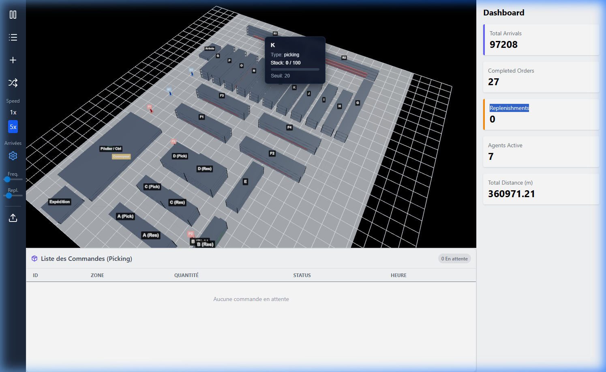

# Rapport Technique : Jumeau Numérique d'Entrepôt (Digital Twin Warehouse)

## 1. Introduction et Contexte du Projet

Le projet **Digital Twin Warehouse** (Jumeau Numérique d'Entrepôt) est une application web interactive qui simule en temps réel les opérations logistiques complexes d'un entrepôt pharmaceutique. L'objectif principal de ce projet est de fournir une visualisation 3D hautement réaliste, similaire à des logiciels professionnels comme FlexSim, tout en offrant des fonctionnalités de gestion et de surveillance via un tableau de bord (Dashboard). 

La combinaison d'une interface utilisateur moderne et d'un moteur de rendu 3D optimisé permet aux utilisateurs d'observer le flux de préparation des commandes, le réapprovisionnement dynamique des stocks, et le contrôle qualité des colis sur le convoyeur. Le système a été conçu pour être à la fois visuellement immersif et techniquement robuste, garantissant une fluidité de fonctionnement directement dans le navigateur.



---

## 2. Architecture Globale et Choix Technologiques

### 2.1. Pile Technologique

| Technologie | Rôle | Justification |
|---|---|---|
| **React 18** | Framework UI | Composants déclaratifs, hooks, cycle de vie géré |
| **Vite** | Bundler / Dev Server | Hot Module Replacement instantané, build optimisé |
| **React Three Fiber (R3F)** | Rendu 3D déclaratif | Scène 3D comme composants React, intégration native |
| **Three.js** | Moteur WebGL | Rendu matériellement accéléré, PBR, shadows |
| **Zustand** | Gestion d'état | Store minimaliste sans boilerplate, sélecteurs fins |
| **Tailwind CSS** | Stylisation UI | Classes utilitaires, responsive, thème cohérent |

### 2.2. Architecture Fichier

```
digital-twin-warehouse/
├── public/
│   └── config.json           ← Configuration de l'entrepôt (zones, nœuds, arêtes)
├── src/
│   ├── simulation/
│   │   ├── Engine.js          ← Moteur de simulation (logique métier pure)
│   │   └── useSimulation.js   ← Hook React : boucle d'animation + synchronisation
│   ├── store/
│   │   └── useWarehouseStore.js ← État global Zustand (agents, commandes, métriques)
│   ├── components/
│   │   ├── WarehouseMap.jsx   ← Scène 3D complète (racks, agents, convoyeur)
│   │   ├── Dashboard.jsx      ← Panneau KPIs et métriques temps réel
│   │   ├── Sidebar.jsx        ← Contrôles de simulation (vitesse, scénarios)
│   │   ├── OrderList.jsx      ← Liste des commandes en cours
│   │   ├── AlertsPanel.jsx    ← Panneau des alertes de l'entrepôt
│   │   ├── ScenariosPanel.jsx ← Interface de test de scénarios What-If
│   │   └── ArrivalsModal.jsx  ← Configuration des distributions d'arrivées
│   └── App.jsx                ← Point d'entrée, chargement config.json
```

### 2.3. Séparation Simulation / Rendu

L'architecture sépare strictement la **logique de simulation** (`Engine.js`) du **rendu visuel** (`WarehouseMap.jsx`). Le flux de données suit un cycle unidirectionnel :

```
config.json → Engine.js → Zustand Store → WarehouseMap.jsx (3D)
                                        → Dashboard.jsx (KPIs)
                                        → OrderList.jsx (commandes)
```

Le hook `useSimulation.js` orchestre ce cycle à chaque frame via `requestAnimationFrame`. À chaque itération :
1. Les agents sont chargés depuis le store (`loadAgents`)
2. Le moteur calcule le nouveau tick (`update(dt, speed)`)
3. Les résultats sont synchronisés vers le store Zustand
4. React re-rend les composants abonnés aux slices modifiés

---

## 3. Configuration de l'Entrepôt (`config.json`)

### 3.1. Dimensions et Zones

L'entrepôt est défini sur une grille de **1200 × 900 unités**. Chaque zone est décrite par un objet JSON :

```json
{
    "id": "zone_A_pick",
    "name": "A (Pick)",
    "x": 100, "y": 300,
    "width": 40, "height": 100,
    "type": "picking",
    "stock": 18,
    "capacity": 100,
    "threshold": 20
}
```

| Type de Zone | Quantité | Rôle |
|---|---|---|
| `picking` | 24 zones | Zones de prélèvement (A-D, E, F1-F4, G-Q, R1-R2) |
| `storage` | 4 zones | Réserves associées (A-D réserves) |
| `inbound` | 1 zone | Zone de réception des arrivages |
| `conveyor` | 1 zone | Tapis roulant pour le contrôle qualité |
| `outbound` | 1 zone | Baie d'expédition |
| `workstation` | 1 zone | Zone Pilulier/Contrôle |

### 3.2. Graphe de Navigation (Nodes & Edges)

Le déplacement des agents repose sur un **graphe orienté non-dirigé** composé de :
- **47 nœuds** (`nodes`) : intersections, extrémités d'allées, points de connexion
- **50+ arêtes** (`edges`) : connexions bidirectionnelles entre nœuds

Chaque nœud possède un identifiant unique et des coordonnées `(x, y)` :

```json
{ "id": "n_F_aisle_top", "x": 540, "y": 180 },
{ "id": "n_F_aisle_mid", "x": 540, "y": 450 },
{ "id": "n_F_aisle_bot", "x": 540, "y": 750 }
```

Les nœuds sont positionnés stratégiquement **dans les allées** entre les racks, garantissant que les agents ne traversent jamais les rayonnages. La topologie forme un réseau de corridors :

- **Corridor supérieur** (`n_top_corridor_1` → `n_top_corridor_4`) : traverse l'entrepôt horizontalement en haut
- **Allées verticales A-E** : desservent les zones A, B, C, D, E de picking et stockage
- **Allée centrale F** : colonne vertébrale verticale reliant le haut au bas de l'entrepôt
- **Rangées horizontales G-Q** : branches latérales desservant chaque zone de picking
- **Allée droite R** : dessert les zones R1 et R2 le long du mur droit
- **Hub inférieur** (`n_bottom_hub`) : convergence de l'allée F et de l'allée R

---

## 4. Moteur de Simulation (`Engine.js`)

### 4.1. Boucle Principale (`update`)

La méthode `update(deltaTime, speed)` est le cœur du moteur. Elle est appelée à chaque frame d'animation (~60 FPS). Le paramètre `speed` est un multiplicateur (1×, 2×, 5×, 10×) qui accélère le temps simulé.

```javascript
const dt = deltaTime * speed;    // Temps effectif écoulé (en heures simulées)
this.simulationTime += dt;       // Horloge interne (démarre à 6h00)
const currentHour = this.simulationTime % 24;  // Heure dans la journée
const currentDay = Math.floor(this.simulationTime / 24) + 1;  // Jour courant
```

L'horloge interne démarre à **6h00 du matin** (début de journée de travail). L'ordre d'exécution à chaque tick est :

1. **Génération des arrivées entrantes** (inbound) par zone
2. **Génération des commandes sortantes** (outbound)
3. **Animation du convoyeur** (progression des colis)
4. **Mise à jour des agents** (FSM + déplacement)
5. **Calcul des métriques avancées** (KPIs)
6. **Détection des alertes** (ruptures, surcharges)

### 4.2. Horloge et Delta Time

Le moteur fonctionne via le **delta time** : le temps réel écoulé entre deux frames est multiplié par la vitesse de simulation. Cela garantit que le comportement est **indépendant du taux de rafraîchissement** — un PC à 30 FPS et un autre à 120 FPS produisent les mêmes résultats de simulation sur la même durée.

```
Temps simulé = Σ(deltaTime × speed)  pour chaque frame
```

Les chronomètres internes (picking, contrôle) sont décrémentés par `dt`, assurant un comportement cohérent quelle que soit la vitesse de jeu.

---

## 5. Distribution Bimodale des Arrivées (Inbound Generation)

### 5.1. Modèle Mathématique

L'intensité des arrivées de marchandises suit une **distribution bimodale gaussienne**, simulant les deux pics d'activité typiques d'un entrepôt réel (matin et après-midi) :

```
λ(h) = (w₁ × G₁(h) + w₂ × G₂(h)) × maxRate
```

Où chaque composante gaussienne est :
```
G_i(h) = exp(-0.5 × ((h - peak_i) / σ_i)²)
```

### 5.2. Paramètres Configurables par Zone

Chaque zone d'arrivée (A, B, C, D) possède ses propres paramètres :

| Paramètre | Défaut | Description |
|---|---|---|
| `peak1` | 9 | Heure du premier pic d'activité (9h00) |
| `peak2` | 14 | Heure du deuxième pic (14h00) |
| `stdDev1` | 1.5 | Écart-type du premier pic (heures) |
| `stdDev2` | 2.0 | Écart-type du deuxième pic (heures) |
| `weight1` | 0.5 | Poids relatif du pic 1 (50%) |
| `maxRate` | 50 | Débit maximum (unités/heure) |
| `enabled` | true | Activation de la zone |

### 5.3. Mécanisme d'Accumulation

Le système utilise un **accumulateur fractionnaire** par zone pour gérer la génération discrète d'événements à partir d'un taux continu :

```javascript
this.accumulators[zone] += intensity * dtHours;

while (this.accumulators[zone] >= 1) {
    this.accumulators[zone] -= 1;
    // Générer un arrivage vers la zone de réception
    reception.arrivalQueue.push({ destination: `zone_${zone}_res`, type: zone });
    reception.stock++;
}
```

Cela convertit un taux continu (ex: `λ = 30 arrivées/heure`) en événements discrets distribués uniformément dans le temps. Les arrivées ne se produisent qu'entre **6h00 et 20h00** (heures de travail).

### 5.4. Flux d'Arrivée

Quand une unité arrive, elle est ajoutée à la **file d'attente de réception** (`reception.arrivalQueue`). Chaque entrée contient :
- `destination` : la zone de réserve cible (ex: `zone_A_res`)
- `type` : le type de zone (A, B, C, D)

Les agents Storekeepers consomment cette file pour transporter les marchandises vers les réserves.

---

## 6. Génération des Commandes Sortantes (Outbound Generation)

### 6.1. Distribution

Les commandes sortantes suivent également une **distribution bimodale** avec ses propres paramètres :

| Paramètre | Défaut | Description |
|---|---|---|
| `peak1` | 10h | Premier pic de commandes |
| `peak2` | 15h | Deuxième pic |
| `maxRate` | 0.1 | Débit max (commandes/heure simulée) |

### 6.2. Création d'une Commande

Lorsque l'accumulateur déclenche une commande, le système :

1. **Vérifie le plafond** : maximum 5 commandes en attente (`pending`) simultanément
2. **Sélectionne une zone cible aléatoire** parmi toutes les zones de type `picking`
3. **Détermine la quantité** : entre 30 et 100 unités (distribution uniforme)
4. **Génère un identifiant unique** : `ORD-{timestamp}-{random}`

```javascript
const newOrder = {
    id: orderId,
    zoneId: targetZone.id,
    quantity: Math.floor(Math.random() * 71) + 30,  // 30 à 100
    status: 'pending',
    creationDay: currentDay,
    creationTime: `${hour}:${min}`,
    assigned: false
};
```

### 6.3. Cycle de Vie d'une Commande

Chaque commande passe par les états suivants :

```
pending → assigned → on_conveyor → controlled → completed
```

| État | Description | Agent responsable |
|---|---|---|
| `pending` | En attente d'un préparateur | — |
| `assigned` | Attribuée à un Picker | Picker |
| `on_conveyor` | Déposée sur le tapis roulant | — |
| `controlled` | Contrôlée qualité par le Controller | Controller |
| `completed` | Livrée à l'expédition | Controller |

### 6.4. Traçabilité Temporelle

Chaque commande est horodatée à chaque transition pour calculer les KPIs :

```javascript
this.orderTimestamps[orderId] = {
    created: this.simulationTime,
    assigned: ...,
    onConveyor: ...,
    controlled: ...,
    completed: ...
};
```

---

## 7. Agents et Machine à États Finis (FSM)

### 7.1. Types d'Agents

L'entrepôt est peuplé de **7 agents** répartis en 3 types :

| Agent | Type | ID | Rôle principal |
|---|---|---|---|
| Magasinier 1-3 | `Storekeeper` | M1, M2, M3 | Réception et rangement des arrivages |
| Préparateur 1-3 | `Picker` | P1, P2, P3 | Préparation des commandes + réapprovisionnement |
| Contrôleur | `Controller` | C1 | Contrôle qualité et expédition |

### 7.2. FSM du Storekeeper (Magasinier)

Le Storekeeper gère le flux **entrant** (réception → réserves). Sa machine à états :

```
            ┌──────────────────────────────────────────────┐
            │                    idle                       │
            └──────┬─────────────────────────┬─────────────┘
                   │ (arrivalQueue non vide)  │ (random 1%)
                   ▼                          ▼
          moving_to_inbound             moving_to_zone
                   │                          │
                   │ (arrive à réception)     │ (arrive)
                   ▼                          ▼
          depositing_reserve              returning
                   │                          │
                   │ (stock déposé)           │ (arrive)
                   ▼                          ▼
                 idle                        idle
```

**Priorité 1 — Arrivages** : Si la file `reception.arrivalQueue` n'est pas vide, le storekeeper prend le premier job, navigue vers la réception, récupère la marchandise (`carrying = 1`), puis se dirige vers la zone de réserve cible pour y déposer le stock.

**Priorité 2 — Patrouille** : Si aucun arrivage n'est en attente, le storekeeper peut (avec une probabilité de 1% par tick) se diriger vers une zone de réserve aléatoire pour simuler une tournée d'inspection.

### 7.3. FSM du Picker (Préparateur)

Le Picker gère le flux **sortant** (picking → convoyeur) et le **réapprovisionnement** :

```
            ┌──────────────────────────────────────────────────┐
            │                      idle                         │
            └──┬──────────────────┬─────────────────┬──────────┘
               │ (commande pending)│ (stock < seuil)  │ (random 1%)
               ▼                  ▼                   ▼
         picking_order      moving_to_reserve     patrolling
               │                  │                   │
               │ (timer=0)       │ (arrive)          │
               ▼                  ▼                   ▼
    delivering_to_conveyor  delivering_replenishment  idle
               │                  │
               │ (arrive)        │ (stock déposé)
               ▼                  ▼
             idle                idle
```

**Priorité 1 — Commandes** : Le picker prend la première commande `pending` non assignée, navigue vers la zone cible, et effectue le picking. Le temps de picking est proportionnel à la quantité : `pickingTimer = quantity × 0.05` heures simulées. Pendant le picking, le `carrying` augmente progressivement (animation visuelle). Une fois terminé, le picker marche jusqu'au convoyeur et y dépose un colis.

**Priorité 2 — Réapprovisionnement** : Si aucune commande n'est en attente, le picker scanne toutes les zones de picking. Pour chaque zone dont le stock est ≤ `threshold` (défaut 20) :
1. Recherche la réserve affiliée (ex: `zone_A_pick` → `zone_A_res`) via `getReserveForPicking()`
2. Si la réserve est vide, recherche **n'importe quelle zone de stockage** avec du stock disponible
3. Vérifie qu'aucun autre agent n'est déjà assigné à cette même zone (`alreadyAssigned`)
4. Calcule la quantité à transférer : `min(réserve.stock, capacité - stock actuel, 50)`

**Priorité 3 — Patrouille** : Déplacement aléatoire vers une zone de picking (probabilité 1% par tick).

### 7.4. FSM du Controller (Contrôleur)

Le Controller gère le **contrôle qualité** et l'**expédition** :

```
          ┌──────────────────────────────────┐
          │              idle                 │
          └──────┬───────────────┬────────────┘
                 │ (colis prêt)   │ (random 0.5%)
                 ▼                ▼
       moving_to_conveyor     patrolling
                 │                │
                 │ (arrive)      │ (arrive)
                 ▼                ▼
           controlling          idle
                 │
                 │ (timer = 0)
                 ▼
     delivering_to_expedition
                 │
                 │ (arrive à shipping)
                 ▼
               idle  (+completedCount)
```

**Contrôle qualité** : Quand un colis atteint la fin du convoyeur (`progress >= 1`), le controller s'y rend, le marque comme `controlled`, et lance un chronomètre de contrôle (`controlTimerBase = 3` heures simulées, ou 6 en scénario `slow_control`). Pendant ce temps, l'agent reste immobile, simulant l'inspection du colis.

**Expédition** : Après contrôle, le controller transporte la commande à la zone `shipping`, la marque comme `completed`, et incrémente le compteur global.

### 7.5. Picking — Détail du Mécanisme

Le picking est la tâche la plus complexe. Quand un picker arrive à la zone de la commande :

1. **Initialisation du timer** : `pickingTimer = quantity × 0.05`
2. **Décompte progressif** : `pickingTimer -= dt` à chaque tick
3. **Animation du portage** : `carrying = floor(progress × quantity)` — l'agent porte progressivement de plus en plus d'articles
4. **Fin du picking** : le stock de la zone est décrémenté de `quantity`, l'agent porte la totalité
5. **Livraison** : l'agent se dirige vers le convoyeur et dépose un colis coloré aléatoirement

---

## 8. Algorithme de Pathfinding (A*)

### 8.1. Principe

Tous les déplacements d'agents utilisent l'algorithme **A*** (A-Star) pour trouver le chemin le plus court dans le graphe de navigation. L'implémentation utilise la **distance euclidienne** comme heuristique admissible :

```javascript
heuristic(a, b) {
    return Math.sqrt((a.x - b.x) ** 2 + (a.y - b.y) ** 2);
}
```

### 8.2. Fonctionnement

1. **`setAgentTarget(agent, zoneId, state)`** : Point d'entrée. Trouve le nœud le plus proche de l'agent et le nœud le plus proche du centre de la zone cible, puis lance A*.

2. **`findNearestNode(x, y)`** : Parcourt tous les nœuds du graphe et retourne celui dont la distance euclidienne à `(x, y)` est minimale.

3. **`findPath(startNode, endNode)`** : Implémentation classique A* :
   - `openSet` : nœuds à explorer (initialisé avec le nœud de départ)
   - `gScore` : coût réel du chemin depuis le départ
   - `fScore` : `gScore + heuristic` (estimation du coût total)
   - `cameFrom` : dictionnaire pour reconstruire le chemin

4. **`getNeighbors(node)`** : Retourne tous les nœuds connectés via les arêtes (bidirectionnel).

5. **`reconstructPath(cameFrom, current)`** : Remonte la chaîne de prédécesseurs pour créer le chemin final.

### 8.3. Suivi du Chemin (`followPath`)

Une fois le chemin calculé (liste de nœuds), l'agent se déplace en **interpolation linéaire** vers chaque nœud successif :

```javascript
const speed = 150;  // unités/seconde
const moveDist = speed * dt;
const ratio = min(moveDist, dist) / dist;
agent.x += dx * ratio;
agent.y += dy * ratio;
```

Quand l'agent arrive à moins de 5 unités d'un nœud, il « snap » exactement dessus et passe au nœud suivant (`path.shift()`). La vitesse de 150 unités/seconde a été calibrée pour un mouvement réaliste à l'échelle de l'entrepôt.

---

## 9. Animation du Convoyeur (Conveyor Belt)

### 9.1. Mécanique de Progression

Les colis sur le convoyeur sont modélisés comme des objets avec un attribut `progress` de 0.0 à 1.0 :

```javascript
const conveyorSpeed = 40;
box.progress += conveyorSpeed * dt;
if (box.progress >= 1) box.progress = 1;  // Arrivé en bout de ligne
```

Un colis avec `progress = 0` est au début du tapis ; `progress = 1` signifie qu'il est arrivé en bout de chaîne, prêt pour le contrôle qualité.

### 9.2. Structure d'un Colis

```javascript
{
    orderId: "ORD-1709...",   // Lien vers la commande
    progress: 0.0,            // Position sur le tapis [0, 1]
    controlled: false,        // Marqué par le controller ?
    startTime: 6.25,          // Heure d'entrée sur le tapis
    color: "#a3f2c1"          // Couleur aléatoire pour le rendu 3D
}
```

### 9.3. Rendu 3D

Dans `WarehouseMap.jsx`, le convoyeur est rendu avec :
- **Rouleaux cylindriques** en rotation continue via `useFrame` (Three.js)
- **Colis colorés** positionnés par interpolation linéaire le long du tapis selon `progress`
- **Matériau métallique** avec des propriétés PBR réalistes

---

## 10. Système de Réapprovisionnement (Replenishment)

### 10.1. Déclenchement

Le réapprovisionnement est déclenché quand une zone de picking tombe sous son **seuil critique** (`threshold`, défaut 20). La vérification est effectuée par les Pickers quand ils sont en état `idle` et qu'aucune commande n'est en attente.

### 10.2. Recherche de Source (Cascade)

L'algorithme de recherche de la source de réapprovisionnement suit une cascade de priorités :

1. **Réserve affiliée** : `zone_A_pick` → cherche `zone_A_res` via le pattern `zone_{lettre}_res`
2. **Réserve globale** : Si la réserve affiliée est vide ou inexistante, recherche dans **toute zone de type `storage`** ayant du stock > 0
3. **Sélection aléatoire** : Si plusieurs réserves globales sont disponibles, une est choisie aléatoirement

### 10.3. Anti-Duplication

Avant d'assigner un réapprovisionnement, le système vérifie qu'aucun autre agent n'est déjà en train de réapprovisionner la même zone :

```javascript
const alreadyAssigned = this.agents.some(a =>
    a.id !== agent.id && a.replenishTarget === pickZone.id && a.state !== 'idle'
);
if (alreadyAssigned) continue;
```

### 10.4. Calcul de la Quantité

```javascript
amount = min(réserve.stock, zone.capacity - zone.stock, 50)
```

La quantité transférée est le minimum entre :
- Le stock disponible dans la réserve
- L'espace restant dans la zone de picking
- Un plafond fixe de 50 unités (capacité de transport de l'agent)

### 10.5. Flux Complet

```
Picker idle → scan des zones picking → stock ≤ threshold ?
    → Cherche réserve affiliée → stock > 0 ? 
        → Oui : va à la réserve, prend stock, livre au picking
        → Non : cherche toute zone storage avec stock > 0
            → Va à la zone, prend stock, livre au picking
```

---

## 11. Modélisation 3D, Rendu Visuel et Réalisme

### 11.1. Environnement et Matériaux Physiques (PBR)

Le sol de l'entrepôt est texturé avec un matériau de béton (`color: "#b3b8c2"`) doté d'une faible composante métallique, recevant de manière dynamique les ombres projetées par l'ensemble des éléments de la scène.
L'éclairage est une combinaison équilibrée :
- Une **Directional Light** principale qui génère les ombres portées (avec un `shadow-mapSize` de 2048x2048 pour la netteté et un biais ajusté pour éviter les artefacts visuels).
- Une **Hemisphere Light** pour simuler la lumière ambiante typique des grands hangars.

### 11.2. Conversion 2D → 3D

Les coordonnées 2D du moteur de simulation sont converties en coordonnées 3D via un facteur d'échelle :

```javascript
const SCALE = 0.05;
// Conversion: to3D(x, y) → [(x - MAP_W/2) * SCALE, 0, (y - MAP_H/2) * SCALE]
```

L'entrepôt 2D de 1200 × 900 unités devient un espace 3D de 60 × 45 unités Three.js.

### 11.3. Rayonnages (Racks)

Les racks utilisent des **géométries partagées** (`sharedGeo`) pour les performances :
- **Poteaux verticaux** : `CylinderGeometry(0.04, 0.04, 1, 6)` — métal gris foncé
- **Étagères horizontales** : `BoxGeometry(1, 0.04, 1)` — gris clair métallique
- **Boîtes de stock** : `BoxGeometry(1, 1, 1)` — générées procéduralement selon le niveau de stock

La hauteur des racks varie selon le type de zone (picking vs stockage), et le nombre d'étagères est calculé dynamiquement.

### 11.4. Animations Humanoïdes Procédurales

Les agents sont animés **procéduralement** (sans squelette importé) :
- **Marche dynamique** : jambes balancées par `Math.sin(elapsedTime)` en opposition de phase
- **Oscillation du buste** : mouvement vertical imitant les pas
- **Transition repos** : `Lerp` fluide pour remettre les membres droits quand l'agent s'arrête

### 11.5. Murs, Plafond, Colonnes

L'entrepôt est encadré par des murs semi-transparents, des colonnes structurelles en acier, des conduits de ventilation, et un plafond avec des fermes triangulaires (trusses) — tous rendus avec des matériaux PBR distincts.

---

## 12. Métriques Avancées (KPIs)

### 12.1. Calcul en Temps Réel

La méthode `computeAdvancedMetrics()` est appelée à chaque tick pour mettre à jour 7 KPIs :

| KPI | Formule | Description |
|---|---|---|
| `avgPrepTime` | Moyenne des 20 derniers temps (assigned → onConveyor) | Temps moyen de préparation |
| `avgControlWaitTime` | Moyenne des 20 derniers temps d'attente sur le convoyeur | Temps moyen d'attente en contrôle |
| `pickerUtilization` | `(pickers occupés / total pickers) × 100` | Taux d'utilisation des préparateurs |
| `conveyorUtilization` | `(colis en queue / 10) × 100` | Taux de saturation du convoyeur |
| `pickingRuptureRate` | `(zones en rupture / total zones picking) × 100` | Taux de rupture de stock |
| `pendingOrders` | Nombre de commandes en statut `pending` | Commandes en attente |
| `throughput` | `completedCount / heures écoulées` | Débit de commandes par heure |

### 12.2. Fenêtre Glissante

Les temps de préparation et de contrôle sont calculés sur une **fenêtre glissante des 20 dernières commandes** (`slice(-20)`), évitant que les données initiales (quand l'entrepôt démarre) ne faussent les métriques courantes.

---

## 13. Système d'Alertes

### 13.1. Types d'Alertes

La méthode `detectAlerts()` identifie 4 types de situation critique :

| Alerte | Sévérité | Condition |
|---|---|---|
| **Rupture de stock** | `critical` | `zone.stock <= 0` |
| **Stock critique** | `warning` | `zone.stock <= threshold × 0.5` |
| **Convoyeur saturé** | `warning` | `conveyorQueue.length > 5` |
| **Préparateurs surchargés** | `critical` | Tous les pickers occupés ET > 3 commandes en attente |
| **Contrôle saturé** | `warning` | > 3 colis en attente de contrôle |

### 13.2. Structure d'une Alerte

```javascript
{
    id: "rupture_zone_A_pick",
    type: "rupture",
    severity: "critical",
    message: "Rupture de stock: A (Pick) — stock épuisé",
    zoneId: "zone_A_pick"
}
```

Les alertes sont synchronisées vers le store Zustand et affichées dans le `AlertsPanel.jsx`.

---

## 14. Système de Scénarios « What-If »

### 14.1. Principe

Le système de scénarios permet de tester des situations hypothétiques sans perdre l'état initial. L'utilisateur peut :
1. **Sauvegarder une baseline** (snapshot des métriques, paramètres, nombre d'agents)
2. **Appliquer un scénario** prédéfini
3. **Réinitialiser** pour revenir à la baseline

### 14.2. Scénarios Disponibles

| Scénario | Effet |
|---|---|
| `plus20_commands` | Augmente le `maxRate` de toutes les arrivées et commandes de **+20%** |
| `minus1_picker` | Retire le dernier Picker de la simulation |
| `fridge_surge` | Double le débit des commandes sortantes (**×2**) |
| `frequent_rupture` | Force le stock de toutes les zones picking à `threshold - 5` |
| `slow_control` | Double le temps de contrôle qualité (3 → 6 heures simulées) |

---

## 15. Système d'Évitement de Collisions (Collision Avoidance)

### 15.1. Détection de Proximité

À chaque itération du moteur, avant de déplacer un agent le long de son chemin, le système calcule la **distance euclidienne** entre cet agent et chaque autre agent :

```
separation = √((other.x - agent.x)² + (other.y - agent.y)²)
```

Si cette distance est inférieure au rayon `COLLISION_DIST = 75` unités, le système active l'évitement.

### 15.2. Calcul des Vecteurs de Direction

Le **produit scalaire** (dot product) des vecteurs de cap normalisés détermine le type de rencontre :
- `dot < -0.3` → Directions **opposées** (rencontre frontale)
- `dot ≥ -0.3` → **Même direction** ou croisement latéral

### 15.3. Esquive Latérale (Head-On Dodge)

Les deux agents esquivent **simultanément** vers leur droite respective. L'offset perpendiculaire :

```javascript
dodgeX += (-hdy) * speed * pushStrength * 0.6;
dodgeY += (hdx) * speed * pushStrength * 0.6;
```

Le `pushStrength` est proportionnel à la proximité. La vitesse est aussi réduite pendant l'approche :
```javascript
speedMultiplier = min(speedMultiplier, 0.5 + (separation / COLLISION_DIST) * 0.5)
```

### 15.4. Décélération Progressive (Following)

Un agent suivant un autre ralentit graduellement :
```javascript
speedMultiplier = min(speedMultiplier, 0.15 + (separation / COLLISION_DIST) * 0.85)
```

### 15.5. Répulsion Générale (Anti-Overlap)

Sous 20 unités, une force de répulsion radiale empêche le chevauchement :
```javascript
dodgeX -= (sepX / sepDist) * speed * repulsion * 0.3;
dodgeY -= (sepY / sepDist) * speed * repulsion * 0.3;
```

### 15.6. Désactivation à l'Arrivée (Anti-Orbiting)

L'évitement est désactivé quand l'agent est sur son **dernier nœud et à moins de 25 unités** de sa destination, empêchant le phénomène d'orbite.

---

## 16. Stationnement Intelligent des Agents Inactifs

Quand un agent `idle` détecte un autre agent à moins de **25 unités**, il :
1. Trouve le nœud le plus proche via `findNearestNode()`
2. Cherche un nœud voisin **libre** (aucun agent à < 30 unités)
3. S'y déplace via l'état transitoire `relocating`

Ce mécanisme garantit que les agents inactifs sont toujours visuellement séparés.

---

## 17. Synchronisation Simulation ↔ Rendu (`useSimulation.js`)

### 17.1. Boucle d'Animation

Le hook `useSimulation()` orchestre la synchronisation via `requestAnimationFrame` :

```javascript
const animate = (time) => {
    const delta = (time - lastTime) / 1000;  // Secondes réelles
    
    if (isPlaying) {
        engine.loadAgents(store.agents);       // 1. Charger l'état actuel
        engine.tasks = store.orders;            // 2. Synchro commandes
        const result = engine.update(delta, speed);  // 3. Tick moteur
        
        store.updateAgents(result.agents);      // 4. Retour agents
        store.updateMetrics(result.metrics);    // 5. Retour métriques
        store.updateTimeInfo(result.timeInfo);  // 6. Retour horloge
        store.setAlerts(result.alerts);         // 7. Retour alertes
        store.updateZoneStock(result.zones);    // 8. Retour stocks
        // ... synchro commandes, convoyeur
    }
    
    requestAnimationFrame(animate);
};
```

### 17.2. Optimisations Mémoire

- **Géométries partagées** (`sharedGeo`) : un seul `BoxGeometry` pour toutes les boîtes de stock
- **Matériaux partagés** (`sharedMat`) : un seul `MeshStandardMaterial` par type de surface
- **`React.memo`** sur tous les composants 3D : évite les re-renders inutiles
- **`useMemo`** pour les textures et calculs coûteux

---

## 18. Défis Techniques et Optimisations Appliquées

### 18.1. Gestion de la Synchronisation Zustand avec l'Animation
Le défi majeur de lier l'état d'objets métiers purs (`Engine.js`) avec le rendu temporel (React Three Fiber) a été de limiter les « Renders » superflus. L'état des tableaux (réappro, commandes) est mis en cache de telle façon que l'UI texte/Tailwind ne se rafraîchit que toutes les ~200ms, garantissant que le Canvas 3D capte un maximum de CPU.

### 18.2. Ajustements du Clipping et Z-Fighting
Les boîtes de stock se mélangeaient à l'armature des étagères. Un ajustement fin en trigonométrie et la déclaration précise d'Offsets au millimètre (ex: `position={[0, sy + boxH / 2 + 0.03, 0]}`) a supprimé l'ensemble des z-fightings.

### 18.3. Calibration des Forces de Collision
Les premières implémentations utilisaient des constantes fixes (`dodgeX += 12`), produisant des décalages de 0.2 unités/frame — invisibles. La solution : rendre les forces **proportionnelles à la vitesse** (`speed × 0.6`), garantissant un décalage visible à toute vitesse.

### 18.4. Paramètres Clés du Système

| Paramètre | Valeur | Localisation |
|---|---|---|
| Vitesse agent | 150 unités/s | `followPath()` |
| Vitesse convoyeur | 40 unités/s | `update()` |
| Temps picking | `qty × 0.05` h | `updateAgentBehavior()` |
| Temps contrôle | 3h (ou 6h) | `controlTimerBase` |
| Seuil réappro | 20 unités | `threshold` par zone |
| Max commandes pending | 5 | `update()` |
| Plafond transport | 50 unités | `replenishment` |
| Rayon collision | 75 unités | `COLLISION_DIST` |

---

## 19. Conclusion et Perspectives

Le **Digital Twin Warehouse** démontre la robustesse de l'écosystème React pour gérer de front une logique applicative exigeante et un rendu graphique 3D intensif, le tout hébergé directement dans un simple navigateur web. Le système algorithmique universel (Pathfinding A*, FSM, distributions bimodales) est assez flexible pour être adapté à d'autres industries complexes.

Le moteur de simulation intègre une modélisation fidèle des flux logistiques pharmaceutiques : distributions d'arrivées bimodales, cycle complet de commande (picking → contrôle → expédition), réapprovisionnement en cascade, et traçabilité temporelle pour les KPIs. Le système d'évitement de collisions reproduit fidèlement le comportement d'opérateurs humains : esquive latérale, distances de sécurité, et stationnement intelligent.

L'ensemble constitue un bac à sable logistique complet permettant aux décideurs de tester des scénarios « What-If », d'identifier les goulots d'étranglement, et d'optimiser les processus avant toute modification physique de l'entrepôt.

**Fin du document.**
