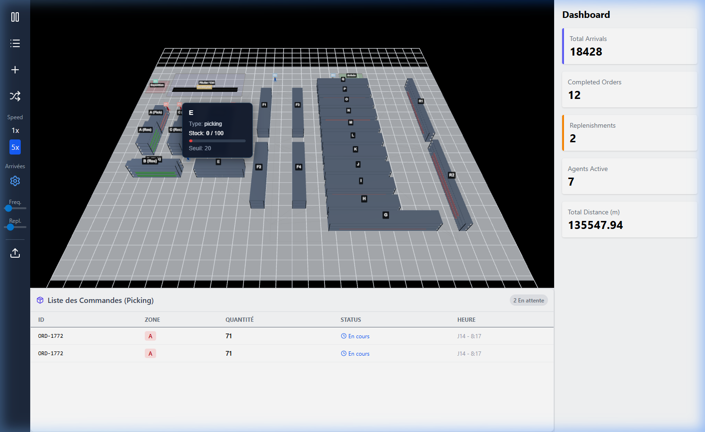
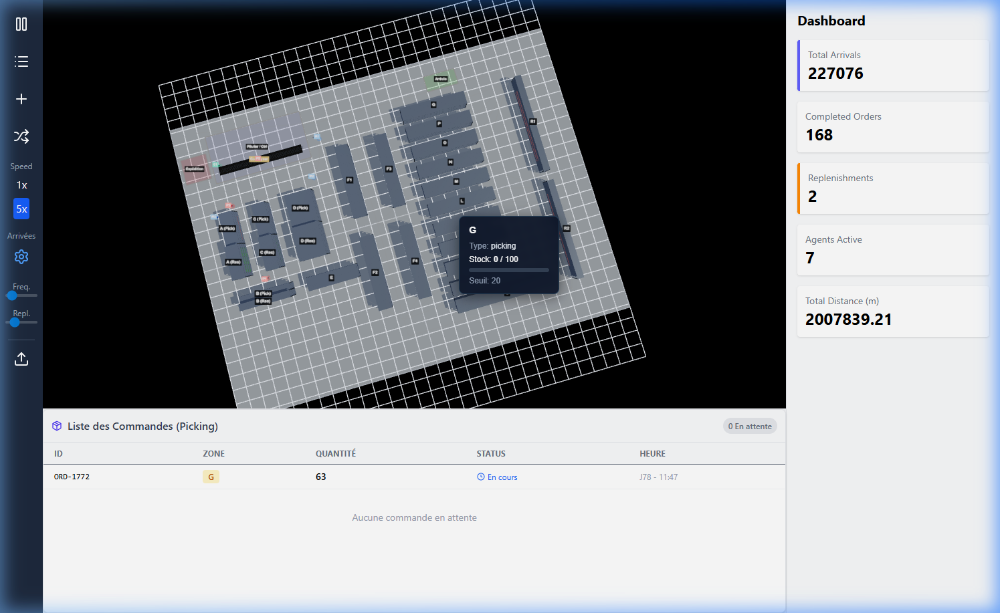

# Rapport Technique : Jumeau Numérique d'Entrepôt (Digital Twin Warehouse)

## 1. Introduction et Contexte du Projet

Le projet **Digital Twin Warehouse** (Jumeau Numérique d'Entrepôt) est une application web interactive qui simule en temps réel les opérations logistiques complexes d'un entrepôt pharmaceutique. L'objectif principal de ce projet est de fournir une visualisation 3D hautement réaliste, similaire à des logiciels professionnels comme FlexSim, tout en offrant des fonctionnalités de gestion et de surveillance via un tableau de bord (Dashboard). 

La combinaison d'une interface utilisateur moderne et d'un moteur de rendu 3D optimisé permet aux utilisateurs d'observer le flux de préparation des commandes, le réapprovisionnement dynamique des stocks, et le contrôle qualité des colis sur le convoyeur. Le système a été conçu pour être à la fois visuellement immersif et techniquement robuste, garantissant une fluidité de fonctionnement directement dans le navigateur.

---

## 2. Architecture Globale et Choix Technologiques

Pour atteindre cet équilibre entre performances graphiques et logique métier complexe, le projet repose sur une pile technologique moderne :

- **React & Vite** : Utilisés comme fondements pour structurer l'interface utilisateur. Vite offre une expérience de développement ultra-rapide et un build optimisé pour la production.
- **React Three Fiber (R3F) & Three.js** : Au cœur de la modélisation 3D, R3F permet de déclarer la scène 3D sous forme de composants React. Three.js assure le rendu WebGL matériellement accéléré.
- **Zustand** : Une bibliothèque minimaliste et performante de gestion d'état responsable de la synchronisation entre le moteur de simulation métier et l'interface utilisateur 3D.
- **Tailwind CSS** : Utilisé pour styliser les panneaux latéraux, le tableau de bord, et les superpositions d'interface (UI) sans alourdir les fichiers CSS.

L'architecture sépare strictement la logique de simulation (`Engine.js`) du rendu visuel (`WarehouseMap.jsx`), permettant ainsi à la simulation de s'exécuter de manière déterministe et indépendante du taux de rafraîchissement graphique.

---

## 3. Modélisation 3D, Rendu Visuel et Réalisme

L'un des défis majeurs a été d'obtenir un rendu industriel réaliste sans surcharger le navigateur (Low-Poly Performant).

### 3.1. Environnement et Matériaux Physiques (PBR)
Le sol de l'entrepôt est texturé avec un matériau de béton (`color: "#b3b8c2"`) doté d'une faible composante métallique, recevant de manière dynamique les ombres projetées par l'ensemble des éléments de la scène.
L'éclairage est une combinaison équilibrée :
- Une **Directional Light** principale qui génère les ombres portées (avec un `shadow-mapSize` de 2048x2048 pour la netteté et un biais ajusté pour éviter les artefacts visuels).
- Une **Hemisphere Light** pour simuler la lumière ambiante typique des grands hangars.

### 3.2. Rayonnages (Racks) et Boîtes de Stockage
Les racks de l'entrepôt utilisent des couleurs métalliques réalistes : un gris métal foncé pour les poteaux verticaux et un gris plus clair pour les poutres horizontales. La grande innovation graphique réside dans la subdivision des stocks : au lieu de dessiner de gros blocs transparents pour indiquer le taux de remplissage, l'application génère de manière procédurale des dizaines de boîtes individuelles opaques sur les étagères, donnant l'illusion parfaite d'une zone de palettes remplie de cartons ou de caisses en plastique mat.

### 3.3. Le Convoyeur Tapis Roulant
Le cœur de la zone de contrôle (Pilulier/Ctrl) est équipé d'un convoyeur modélisé avec un réalisme algorithmique.
- **Les Rouleaux** : Une série de cylindres métalliques est disposée tout le long du convoyeur. Un hook React `useFrame` fait tourner physiquement chaque rouleau autour de son axe local en temps réel.
- **Les Colis** : Les préparateurs déposent les colis qui glissent ensuite de manière fluide le long de la rampe pour atteindre la fin de chaîne.

### 3.4. Animations Humanoïdes Procédurales (Agents FlexSim Style)
Pour éviter la lourdeur des squelettes animés importés (Bones/Rigging), les agents bénéficient d'une animation corporelle générée mathématiquement (procédurale) pendant la boucle de rendu :
- **Marche Dynamique** : Lorsqu'un agent se déplace vers un nœud, ses deux jambes se balancent de manière opposée selon une fonction sinusoïdale liée au temps (`Math.sin(elapsedTime)`). 
- **Oscillation du Buste** : Le corps (gilet) et la tête subissent un léger mouvement vertical répétitif imitant les pas lourds d'un opérateur logistique. 
- **Retour au repos** : Dès que l'agent atteint sa cible ou effectue une tâche statique, une transition lisse (Lerp) remet les jambes droites et le corps au repos.

---

## 4. Moteur de Simulation (Simulation Engine)

Le cerveau de l'entrepôt est structuré autour d'une classe Javascript orientée objet (`Engine.js`). Cette instance est mise à jour en continue via une fonction de rafraîchissement propulsée en tâche de fond.

### 4.1. Le Graphe de Déplacement (Pathfinding)
Le déplacement des agents s'appuie sur un graphe composé de *Nodes* (Nœuds) et d'*Edges* (Arêtes). Tous les mouvements d'un point A à un point B de l'entrepôt utilisent un algorithme **A*** (A-Star). L'architecture des nœuds a été calibrée pour forcer les agents à emprunter les couloirs et à contourner de manière stricte la zone centrale complexe du "Pilulier" pour éviter le "clipping" à l'écran.

### 4.2. L'Horloge Interne
L'Engine fonctionne grâce à un paramètre de *Delta Time* (`dt`). Cela permet de gérer le multiplicateur de vitesse (Speed : 1x, 2x, 5x, 10x). Le temps écoulé dans le jeu fait croître les chronomètres internes (les temps de "picking", les temps de "control") sans altérer la fréquence de la logique.

---

## 5. Intelligence Artificielle et Logique Métier (FSM)

Les 7 agents de l'entrepôt (3 Pickers, 3 Storekeepers, 1 Controller) possèdent chacun une machine à états finis (Finite State Machine). Chaque agent vérifie en boucle son état (Idle) pour déterminer sa tâche la plus prioritaire.

### 5.1. Logique Universelle de Réapprovisionnement
L'une des fonctions les plus abouties est le réapprovisionnement dynamique :
- Lorsqu'une commande sortante puise trop dans une étagère de *picking* et que sa quantité tombe sous le seuil critique (ex: < 20), une requête de remplissage est générée.
- **Délégation** : Ce sont les agents Rouges (*Pickers*) qui, lorsqu'ils n'ont plus de commandes urgentes, assument le réapprovisionnement.
- **Recherche Goutte-à-Goutte** : Ils calculent d'abord s'il existe une réserve explicitement affiliée à l'étagère vide. S'il n'y en a pas, ou que la réserve est vide, l'algorithme lance un balayage global de l'entrepôt pour extraire la ressource manquante de **n'importe quelle zone de stockage** disponible, garantissant ainsi qu'aucune zone de picking ne reste définitivement vide à `0/100`.

### 5.2. Logistique de Préparation et d'Expédition
- **Picking** : Le préparateur reçoit la commande, navigue vers la zone A, B, C, etc., s'amarre pendant quelques secondes (selon la quantité), prélève le stock, et marche jusqu'au début de la rampe de convoyeur pour y larguer un cube coloré.
- **Contrôle Qualité** : L'agent Vert (*Controller* - reconnaissable à son casque coordonné) arpente la station Pilulier. Dès qu'un paquet arrive au bout du tapis roulant, il le saisit. S'ensuit une temporisation liée au contrôle qualité humain.
- **Expédition** : Après examen, ce même agent livre la commande validée à la baie d'Expédition ("Shipping Outbound"), incrémentant par la même occasion la jauge de "Completed Orders".

---

## 6. Interface Utilisateur (UI) / Tableau de Bord

Bien que le projet soit intimement lié à l'espace 3D, l'interaction utilisateur est rendue intuitive par une interface flottante développée avec Tailwind CSS.

### 6.1. Le Hub d'Information (Dashboard)
Sous l'espace 3D principal loge une liste dynamique des commandes (Pending, On_Conveyor, Controlled, Completed). Mais c'est sur la droite de l'écran que s'illustre  le cœur analytique :
- Suivi en direct du nombre total des commandes planifiées, en transit et terminées.
- Compteur des réapprovisionnements (Replenishments) permettant à l'observateur d’évaluer la fréquence de remplissage des rayons.

### 6.2. Contrôle Divin (Sidebar)
L’utilisateur peut influencer le déroulement de la simulation de diverses manières :
- Ajout de commandes aléatoires supplémentaires pour provoquer des ruptures de charge massives.
- Manipulation du multiplicateur de vitesse pour "Skipper" le temps (utile pour diagnostiquer rapidement les goulots d'étranglement logistiques à long terme).
- Le nouveau bouton **Randomize Stock (🔀)**, redoutable pour stresser l'algorithme de réapprovisionnement en secouant littéralement le niveau de tous les stocks des zones de façon aléatoire.

---

## 7. Défis Techniques et Optimisations Appliquées

### 7.1. Gestion de la Synchronisation Redux/Zustand avec l'Animation
Le défi majeur de lier l'état d'objets métiers purs (`Engine.js`) avec le rendu temporel (React Three Fiber) a été de limiter les "Renders" superflus. Au lieu de re-calculer les géométries à chaque image de simulation (60 FPS), des références vers des géométries monolithiques partagées (`sharedGeo`) et des matériaux (`sharedMat`) sont allouées en mémoire via `useMemo`. 
L'état des tableaux (réappro, commandes) est quant à lui mis en cache de telle façon que l'UI texte/Tailwind ne se rafraîchit que toutes les ~200ms dans `useSimulation.js`, garantissant que le Canvas 3D de l'entrepôt capte un maximum de CPU.

### 7.2. Ajustements du Clipping et Z-Fighting
Lors du premier montage, les boîtes de stock se mélangeaient à l'armature des étagères. Un ajustement fin en trigonométrie et la déclaration précise d'Offsets au millimètre (ex: `position={[0, sy + boxH / 2 + 0.03, 0]}`) a supprimé l'ensemble des z-fightings.

---

## 8. Conclusion et Perspectives

Le **Digital Twin Warehouse** démontre la robustesse de l'écosystème React pour gérer de front une logique applicative exigeante et un rendu graphique 3D intensif, le tout hébergé directement dans un simple navigateur web. Le système algorithmique universel (Pathfinding A*, FSM, R-Trees abstraits) est assez flexible pour être adapté à d'autres industries complexes.

L'ajout d'animations procédurales de type FlexSim et l'introduction d'un véritable tapis roulant texturé et fonctionnel poussent l'immersion technologique à son paroxysme sans dépendre d'outils propriétaires hors de prix, fournissant un excellent bac à sable logistique aux décideurs.

**Fin du document.**
